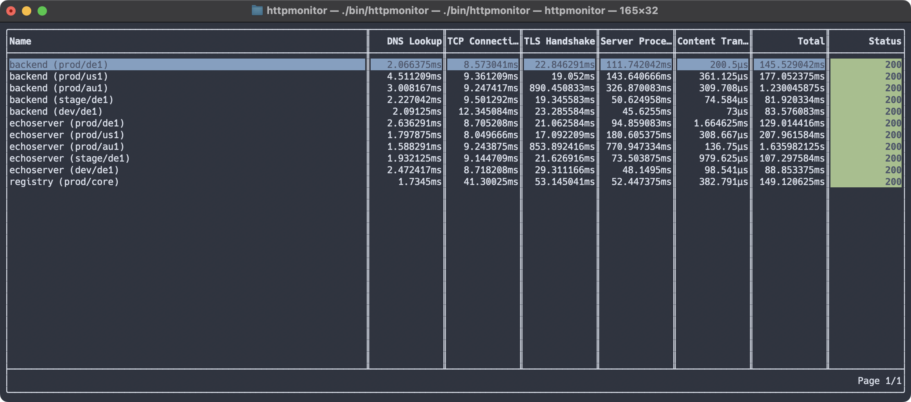
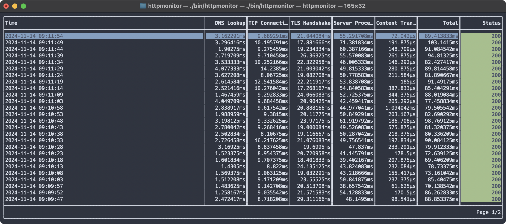

# httpmonitor

`httpmonitor` is a small TUI application to monitor a single or multiple
targets.





## Install

### Releases

Check the [releases](https://github.com/ricoberger/httpmonitor/releases) page
for the full list of pre-built binaries.

1. Download the release for your os/arch
2. Unzip to archive to get the `httpmonitor` binary
3. Add the `httpmonitor` binary to your `PATH`

### Source

```sh
go install github.com/ricoberger/httpmonitor@latest
```

## Usage

```
Usage of httpmonitor:
  -body string
        The body to send with the HTTP checks.
  -config string
        The path to the configuration file. (default "/Users/ricoberger/.httpmonitor.yaml")
  -insecure
        Skip TLS certificate verification.
  -interval duration
        The interval to run the HTTP checks. (default 5s)
  -method string
        The HTTP method to use for the checks. (default "GET")
  -notification
        Enable desktop notifications, for failed checks.
  -notification-threshold duration
        Enable desktop notifications, for checks which are longer than the threshold.
  -password string
        The password which should used, when the target requires basic authentication.
  -timeout duration
        The timeout for the HTTP checks. (default 2s)
  -token string
        The token which should used, when the target requires token authentication.
  -url string
        The url of the target to monitor.
  -username string
        The username which should used, when the target requires basic authentication.
```

To monitor a single target, the following command can be used:

```sh
httpmonitor -url https://example.com -interval 1s
```

To monitor multiple targets, a configuration file can be used:

```yaml
targets:
  - name: example
    url: https://example.com
    method: GET
    body:
    username:
    password:
    token:
    insecure: false
    notification:
    notificationThreshold:
    interval: 5s
    timeout: 5s
```

## Development

To build and run the binary the following commands can be used:

```sh
go build -o ./bin/httpmonitor .
./bin/httpmonitor
```

To publish a new version, a new tag must be created and pushed:

```sh
make release-patch
make release-minor
make release-major
```
